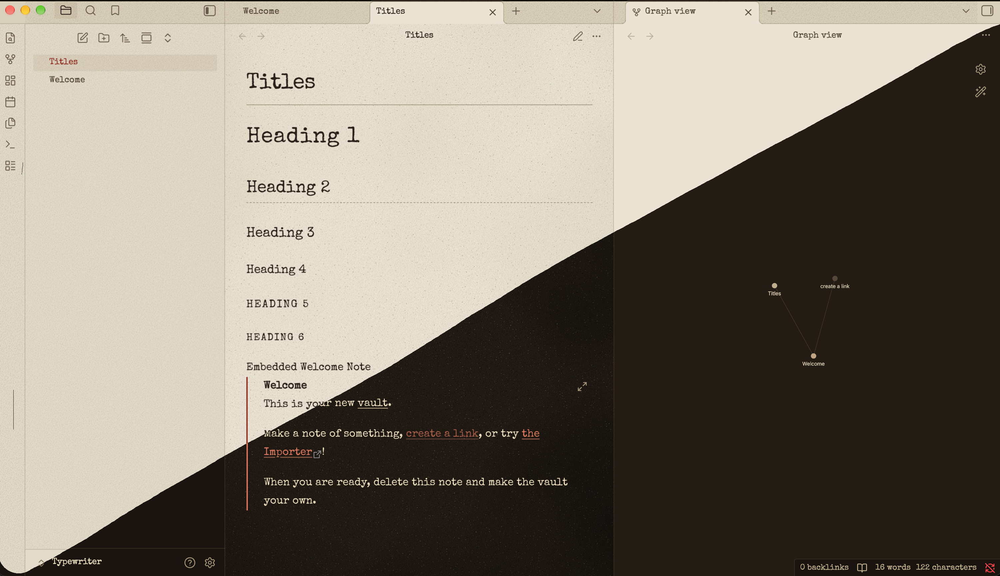

# Typewriter-Vin

An Obsidian theme that makes your notes look typed on the pale, aged paper of an old hardback. It comes in two modes: a light mode with cream paper, and a dark mode that looks like the same page read at night.

## Features

- **Typewriter font:** Special Elite, a worn typewriter face. It's built into `theme.css`, so it works offline and you don't need to install anything else.
- **Paper texture:** pale, greyish-cream paper with fine grain, scattered pores, soft uneven toning and a slight vignette at the edges.
- **Ink:** black-brown ribbon ink that bleeds slightly into the paper.
- **Red accent:** links, tags, checkboxes and the text cursor use the red half of a two-colour typewriter ribbon.
- **Typewriter habits:** a typewriter has only one weight of type, so **bold** is drawn as a double strike and *italics* are underlined. Section breaks (`---`) appear as `*   *   *`.
- **Code blocks:** a plain tinted panel with no borders or lines, set in a thickened Courier New. Syntax colours in light mode are bright enough to stand out on the cream paper.
- **Dark mode:** dark sepia paper with cream ink.

## Installation

### From the community theme store

1. Open **Settings → Appearance → Themes** and click **Manage**.
2. Search for **Typewriter-Vin**, then click **Install and use**.

### Manually

1. Download `theme.css` and `manifest.json` from the [latest release](https://github.com/Varunsai85/Typewriter-Vin/releases/latest).
2. Put both files in a folder called `Typewriter-Vin` inside `<your vault>/.obsidian/themes/`.
3. Open **Settings → Appearance → Themes** and choose **Typewriter-Vin**.

## Compatibility

Requires Obsidian 1.5.0 or later. Works with both light and dark base themes.

## License

The theme is released under the [MIT License](./LICENSE).

The bundled Special Elite font has its own license, the [Apache License 2.0](./FONT-LICENSE.txt).

## Credits

Special Elite by Astigmatic (Brian J. Bonislawsky), used under the Apache License 2.0.
